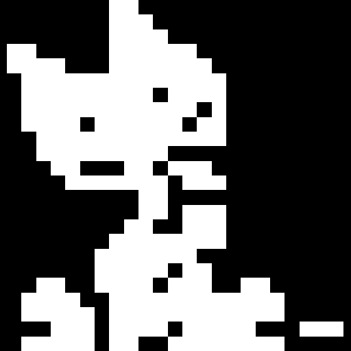

<div align="center">
  <br />
  
  <h1>Oneko</h1>
  <p>A tiny pixel cat that makes React apps feel alive.</p>
  <p>
    <a href="https://oneko.dhrv.pw">Playground</a>
    ·
    <a href="https://oneko.dhrv.pw/docs">Documentation</a>
    ·
    <a href="https://oneko.dhrv.pw/docs.md">Markdown guide</a>
  </p>
  <p>
    <a href="https://github.com/0xdhrv/oneko/stargazers"></a>
    <a href="https://github.com/0xdhrv/oneko/blob/main/LICENSE"></a>
  </p>
  <br />
</div>

Oneko is an installable [shadcn registry](https://ui.shadcn.com/docs/registry) component that adds a
pixel-art cat to your React app. It follows the pointer, naps when things are quiet, shares
cat-themed thoughts, and can be tailored to feel at home on your site.

## Install

```bash
npx shadcn@latest add https://oneko.dhrv.pw/r/oneko.json
```

The registry installs the component, hooks, animation engine, bundled skins, and skin credits into
your project—so you can own and customize the code.

## Use it

Render one `Oneko` from a client component. It mounts itself on `document.body`, keeping it above
your app without adding layout wrappers.

```tsx
"use client";

import Oneko from "@/components/oneko";

export function CatLayer() {
  return <Oneko />;
}
```

For SSR-enabled apps, render this client component from the appropriate client-only boundary. In
Next.js App Router, a client wrapper with `dynamic(..., { ssr: false })` is a convenient option—see
the [installation guide](https://oneko.dhrv.pw/docs#installation) for the complete setup.

## Make it yours

```tsx
<Oneko
  skin="calico"
  speed={12}
  bubbleText="treat inspection in progress"
  bubblePlacement="above"
  sleepEnabled
  meow={false}
/>
```

| It comes with             | Why it matters                                                             |
| ------------------------- | -------------------------------------------------------------------------- |
| 12 crisp pixel-art coats  | Switch skins instantly without restarting the animation.                   |
| Pointer and touch support | The cat follows the cursor; on touch, tap an empty spot to call it over.   |
| Bubbles and naps          | Tune the cat’s thoughts, placement, size, chattiness, and sleepy moments.  |
| Optional sounds           | Add the supplied `.ogg` files when you want audio, or keep `meow={false}`. |
| Zones                     | Keep the cat clear of important UI or give it favorite places to visit.    |
| Integration controls      | Pause it, persist its position, change its layer, observe state, and more. |

### Keep the cat out of the way

Mark elements the cat should avoid, or spots it should enjoy visiting:

```tsx
<header data-oneko-zone="avoid">Navigation</header>
<aside data-oneko-zone="attract">Cat-approved reading nook</aside>
<Oneko />
```

You can also provide selector- and rectangle-based zones through the `zones` prop. Read the
[zones guide](https://oneko.dhrv.pw/docs#zones) for options and examples.

### Add sound

Sound is optional. To enable it, copy this repository’s `public/cat-sounds/` directory into your
app’s public assets and keep the default `soundBasePath="/cat-sounds"`. Otherwise, set
`meow={false}`. Browsers may wait for a visitor’s first interaction before playing audio.

## Documentation

The [documentation](https://oneko.dhrv.pw/docs) is the complete source of truth for props,
framework recipes, sound setup, zones, public types, and a prompt for coding agents. Prefer its
[Markdown version](https://oneko.dhrv.pw/docs.md) when working from a terminal or with an agent.

## Develop the playground

This repository hosts the Oneko playground and the registry output served at
`/r/oneko.json`.

```bash
pnpm install
pnpm dev
```

Useful checks:

```bash
pnpm lint
pnpm fmt:check
pnpm test
pnpm build
```

`pnpm build` regenerates the registry before building the site. Use `pnpm run registry:build` when
you only need to refresh `public/r/oneko.json`.

## Project map

| Path                      | Purpose                                            |
| ------------------------- | -------------------------------------------------- |
| `components/oneko.tsx`    | Thin, installable React component shell.           |
| `hooks/` and `lib/oneko/` | Animation hook and engine.                         |
| `registry.json`           | Source manifest for the shadcn registry item.      |
| `public/r/`               | Generated registry JSON served to installers.      |
| `app/`                    | Next.js playground and documentation routes.       |
| `docs/`                   | Component API, skins, and local-development notes. |

## Credits and license

Oneko is inspired by [adryd325/oneko.js](https://github.com/adryd325/oneko.js) and the skin gallery
in [oneko-swift](https://github.com/oneko-swift/oneko-swift). The sprite artwork belongs to its
original creators; see [skin credits](docs/skins.md) for attribution and sources.

The code is available under the [MIT License](LICENSE).
